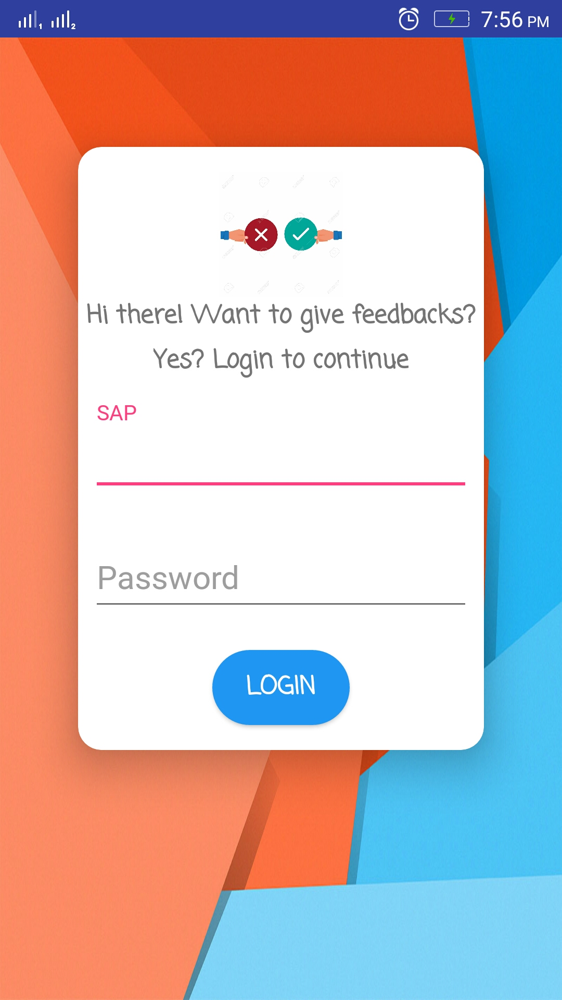
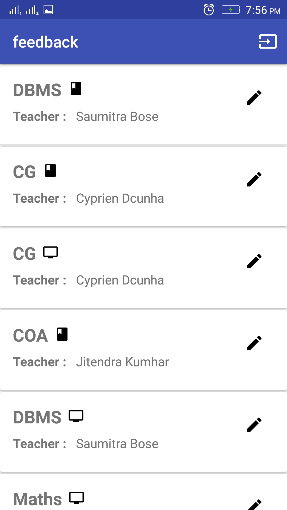
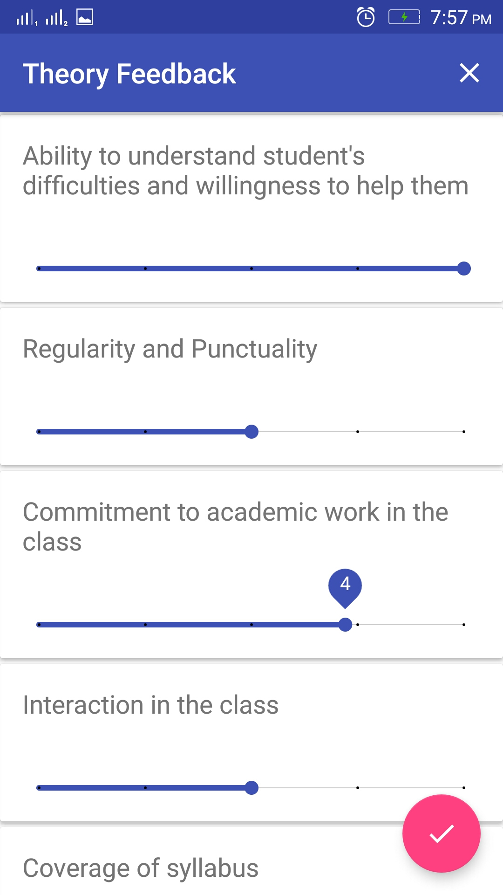

# Feedback:Android

This is the server/web app for a college faculty feedback application that we built over the course of 8 hours during D.J.S.C.O.E's ACM chapter's hackathon (API - Analyze, Plan, Integrate).The app interface is provided to the user to fill the feedback form and the data is then sent to the server.The web component of the app is [here](https://github.com/imtoobose/api-feedback-server).
This was built in collaboration with [@imtoobose](https://github.com/imtoobose) and [@jitendra9873](https://github.com/jitendra9873)

# App Screenshots:

Login | Subjects | Feedback 
:-------------------------:|:-------------------------:|:-------------------------:
  |   | 

Note:
The login details are available [here](app/src/main/java/api/feedback/LoginActivity.java#L36)